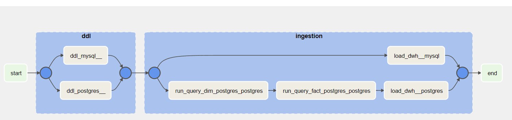

# TASK 1

## Setup Virtual Environment
### Prerequisite
- [WSL](https://learn.microsoft.com/en-us/windows/wsl/install)
- [Python 3.7 or above](https://www.python.org/downloads/)
- [MySQL](https://dev.mysql.com/downloads/installer/)
- [PostgreSQL](https://www.postgresql.org/download/windows/)
### Command
Run this in WSL inside the task1 folder.

```
sudo pip install virtualenv
virtualenv -p python3 venv
source venv/bin/activate

pip install -r requirements.txt
```

## Setup Airflow
1. Run this in WSL to install Airflow in your desired directory.
    ```
    export AIRFLOW_HOME=$(pwd)
    AIRFLOW_VERSION=2.3.4
    PYTHON_VERSION="$(python --version | cut -d " " -f 2 | cut -d "." -f 1-2)"
    CONSTRAINT_URL="https://raw.githubusercontent.com/apache/airflow/constraints-${AIRFLOW_VERSION}/constraints-${PYTHON_VERSION}.txt"
    pip install "apache-airflow==${AIRFLOW_VERSION}" --constraint "${CONSTRAINT_URL}"
    ```
2. Initialize db
    ``` 
    airflow db init
    ```
3. Create user account
    ```
    airflow users create \
        --username admin \
        --firstname Peter \
        --lastname Parker \
        --role Admin \
        --email spiderman@superhero.org
    ```
    Then input password.

4. Run airflow
    ```
    airflow webserver --port 8080
    ```
    Open in different terminal
    ```
    airflow scheduler
    ```
5. Your airflow is ready on `http://localhost:8080/`. Login with your created credential when creating user.

## Airflow DAG and its tasks

*Ingestion DAG*

### Tasks
1. ddl_mysql__ = Run DDL for populating MySQL database.
2. ddl_postgres__ = Run DDL for populating PostgreSQL database.
3. load_dwh__mysql = Run script to load MySQL tables to data warehouse (`data/dwh_hr.db`).
4. run_query_dim_postgres_postgres = Run SQL script to generate dimension tables in PostgreSQL.
5. run_query_fact_postgres_postgres = Run SQL script to generate fact table in PostgreSQL.
6. load_dwh__postgres = Run script to load PostgreSQL dimension and fact tables to data warehouse (`data/dwh_chinook.db`).