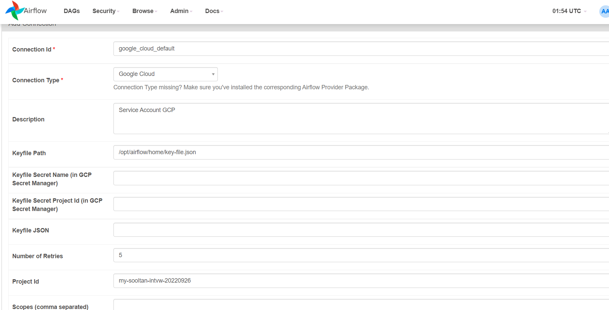

# TASK 2

## Prerequisite
Google Cloud Platform project and its billing.

## Setup Airflow with Docker in GCE VM

Steps:
1. Create Service Account to give minimum access to BigQuery with the role of BigQuery Job User and Dataflow with the role of Dataflow Worker.
2. Create Virtual Machine. Allow HTTPS and HTTP traffic and select the Service Account created. Deploy a Debian instance with these requirements:

    - e2-standard-2 (2vCPU, 8GB memory)
    - Debian 10
    - 50 GB HDD
3. Install Docker by running these command
    ```
    sudo -s
    apt update
    apt install --yes apt-transport-https ca-certificates curl gnupg2 software-properties-common
    curl -fsSL https://download.docker.com/linux/debian/gpg | sudo apt-key add -
    add-apt-repository "deb [arch=amd64] https://download.docker.com/linux/debian $(lsb_release -cs) stable"
    apt update
    apt install --yes docker-ce
    ```
4. Install Docker Compose by running this command
    ```
    curl -L "https://github.com/docker/compose/releases/download/1.29.1/docker-compose-$(uname -s)-$(uname -m)" -o /usr/local/bin/docker-compose
    chmod +x /usr/local/bin/docker-compose
    docker-compose --version
    ```
5. Install Airflow by Docker

    Copy `docker-compose.yaml` in your repo
    ```
    curl -LfO 'https://airflow.apache.org/docs/apache-airflow/2.3.4/docker-compose.yaml'
    ```
    Setting Airflow User
    ```
    mkdir -p ./dags ./logs ./plugins
    echo -e "AIRFLOW_UID=$(id -u)" > .env  
    ```
    Initialize database
    ```
    docker-compose up airflow-init
    ```
    Running Airflow
    ```
    docker-compose up
    ```
6. Add Firewall Rule for `port:8080` and whitelist VM IP. You can follow [this step](https://medium.com/apache-airflow/a-simple-guide-to-start-using-apache-airflow-2-on-google-cloud-1811c2127445#:~:text=5.-,First%20execution,-Yes!%20We%20are).
7. Open your running Airflow in https://COMPUTE-ENGINE-IP:8080 and login with this default credential:
    ```
    username: airflow
    password: airflow
    ```

> **Note**
> Airflow with Docker in GCE VM is currently not running using this repo because of IP whilelist issue. So I will run docker in local system

8. Create connection to GCP Service Account

Prior to this you will need to setup `docker-compose.yml` in `volume` section and add this
```
/c/Users/ekaap/OneDrive/Documents/Career/Interview/Telkom:/opt/airflow/home
```
