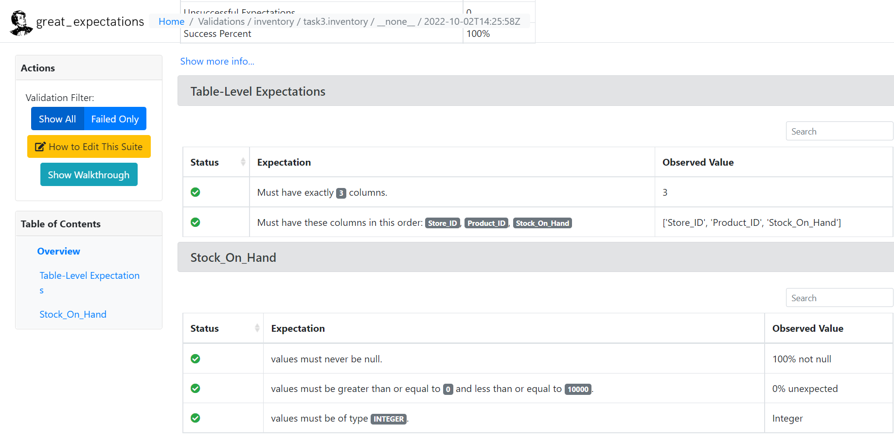

# Task 3

## Setup
### Google Cloud SDK
Follow the installation instruction [here](https://cloud.google.com/sdk/docs/install) then add .\Google\Cloud SDK\google-cloud-sdk\bin into your environment variable.
### Great Expectations (GE)
Run this in WSL command line
```
pip install great_expectations
```

## Bash
In `task3` directory run this command
```
bash gcloud.sh
```
`gcloud.sh` contains commands to
- Create GCS Bucket
- Upload files to GCS
- Create BigQuery tables from GCS CSV files

These are the tables created in BigQuery.


## Great Expectations (GE)
### Connect Data Source
We will connect GE with BigQuery data source. Run this command in WSL
```
great_expectations datasource new --no-jupyter
```
Select `2` then `2`. Run this command to open Jupyter Notebook
```
jupyter notebook /usr/app/great_expectations/uncommitted/datasource_new.ipynb --allow-root --ip=0.0.0.0
```
Then open link provided. You will see this Jupyter Notebook UI from `http://127.0.0.1:8888`.

Edit `datasource_new.ipynb` with following changes
```
datasource_name = "{datasource_name}"
connection_string = "bigquery://{project_id}/{dataset_id}"
schema_name = {dataset_id}  # or dataset name
table_name = {table_name} # select one
```
Run all cells.
> **Note**
> It's better to put GCP Service Account key in the uncommitted directory to prevent warning.

### Create Expectation
Next step is we need to define the expectation of every table. To create Expectation, run this command
```
great_expectations suite new --no-jupyter
```
Select `Interactively, with a sample batch of data`, select `default_inferred_data_connector_name`, then select data source and table. Give name to Expectation Suite too. After done, you can find the Jupyter Notebook for your newly created Expectation in `http://127.0.0.1:8888`.
Add expectations / tests for the table in the Jupyter Notebook by adding this code for table
```
validator.expect_table_{expectation}
```
or this code for column
```
validator.expect_column_{expectation}
```
Refer to [this](https://greatexpectations.io/expectations/) for exploring expectations.

After all expectations added, run all cells. Repeat the steps for every tables.

### Create Checkpoint for New Data
Run this command to generate checkpoint Jupyter Notebook
```
great_expectations checkpoint new checkpoint_{table_name}
```
Edit these following
```
data_asset_name: {dataset_name}.{table_name}_new
```
Run all cells. Uncomment this code
```
context.run_checkpoint(checkpoint_name=my_checkpoint_name)
```

### Generate Docs
Run this command
```
great_expectations docs build --site-name local_site
```
Then open `great_expectations/uncommitted/data_docs/local_site/index.html`. The added Expectations and Checkpoints will be shown in the home like this:

You can also see the result of testing:

